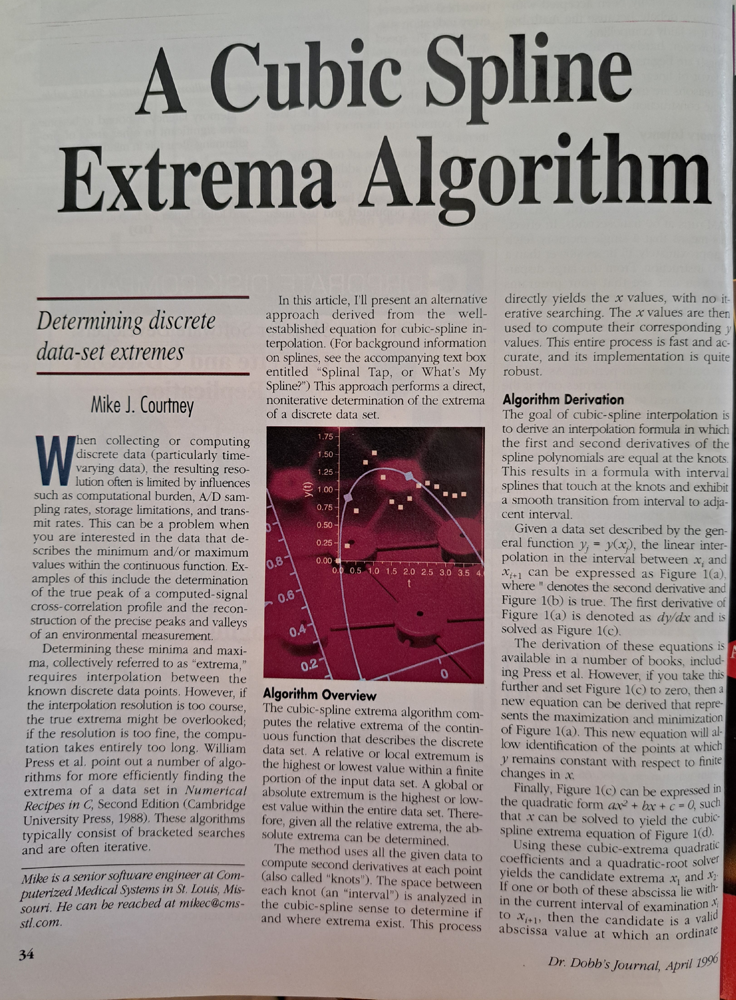
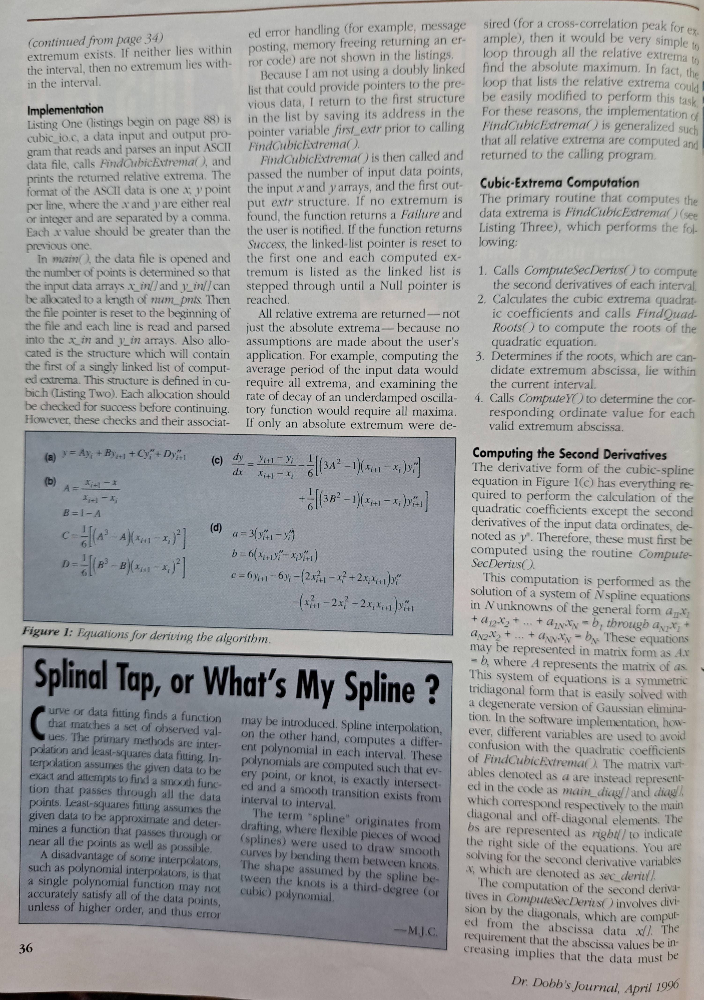
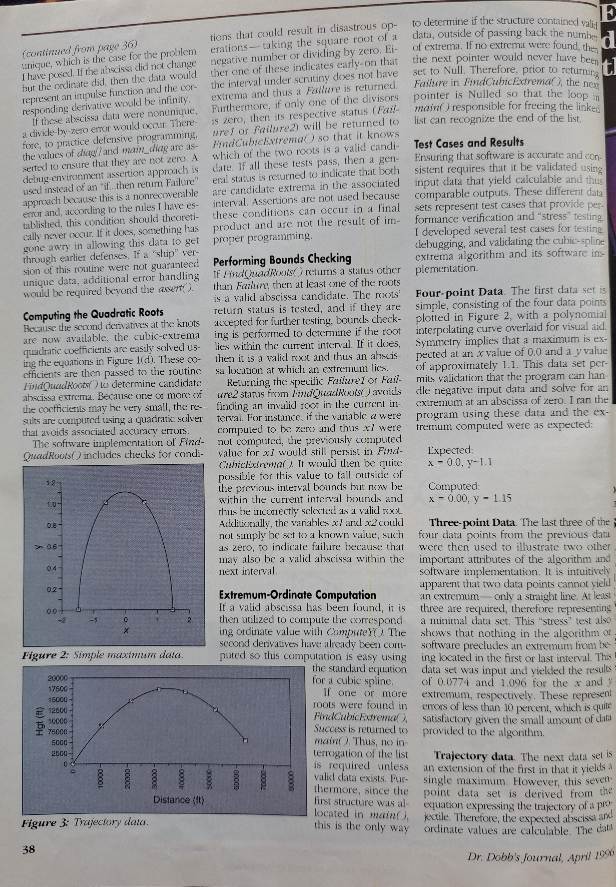
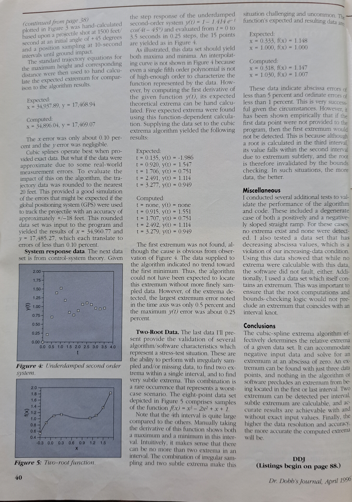

# CubicSplineExtrema

Welcome to the repository of the software algorithm that I invented/derived back in 1994 and then was published in Dr. Dobb's Journal in 1996. That journal was the premier software engineering magazine back in those days and I was a subscriber. Thus I was honored that my algorithm, explanation, and implemenation were chosen to be printed within it's covers. And they actually paid me for my work ... well a small sum anyway.

The algorithm essentially computes the minima and maxima (i.e. peaks and valleys) *directly* for a set of discrete data points. Typical searches require the use of bracketed iterative searches and are hence much less efficient. My approach instead goes directly for a solution that computes a second derivative spline at the data "knots", and thus provides a fast and accurate set of results. The algorithm and implementation handles both "happy path" and "unhappy path" test cases, as exhibited by the test data sets used in the development of the algorithm. Those data sets were presented in the original article, and are provided here for running verification tests.

Here is my tattered copy of the magazine cover 😃

For some background, I actually came up with the algorithm when my then-boss came to me with a problem. He had some images that he was computing cross-correlations of to figure out the proper stereoscopic perspectives. He asked if I knew of a way to figure out the best correlation point (the peak value) quicker instead of the iterative shifting and computing that he was performing. I did not, but told him I would research it. I was not able to find any way in the literature (image processing magazines and books) or "online" (which was in it's early days back then). Therefore I thought about the problem and it seemed to me that given a set of cross correlation "similarity" values I should be able to take a good guess at what the peak value should be. And I surmised that this came down to a data best fit problem in which I wanted to force an unknown polynomial function to go through those measured values precisely. That felt like something that a set of cubic splines could solve somehow. I realized that if I were to compute the first and second derivatives of a set of spline polynomials such that they are equal at each "knot" (i.e. input value), then the result would be a formula whose splines exhibit a smooth transition between the knots while also traveling directly through them. So I went to work on deriving the equations in my free time, conjurred up some test data based on known equations, and many hours and pages of equation derivations later I had something that worked on paper!

But by then my boss had already found a different approach for his needs, so I sat my work aside for a couple years until I decided to generalize the algorithm a bit more and then coded it in the C language to fully test it out ... and it actually worked ! So I thought it was worth sharing with others and submitted an abstract to Dr. Dobb's. And they contracted me to write up a full article based on my work. Yay !

Here are the first of the 4 pages of my ramblings, and the code was printed at the back and is available here in this repository.
Also, since these magazine page photos are hard to read, here is most of text in html form that might be easier, but just not as fancy and comprehensive.

 
 

The algorithm was originally implemented in the C language and that is available in the `c_lang` directory.
To learn more about the algorithm, I have put together some details [here](https://mikecsplayplace.github.io/CubicSplineExtrema/CubicSplineExtremaAlgorithm.html). 

A fairly extensive and varying collection of test data were used in the development and testing of the algorithm. Most of these are captured in the `test_data` directory. It contains the original data I used in the article and some additional data. Also provided in that directory's [README](./test_data/README.md) are detailed explanations of the input data, expected output data, results, and some pretty plots.

A preliminary (but functional) version in C# is also available in the 'csharp_lang' directory.
