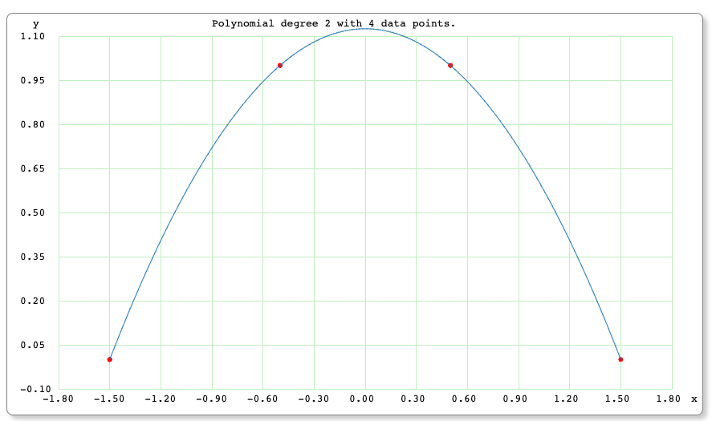
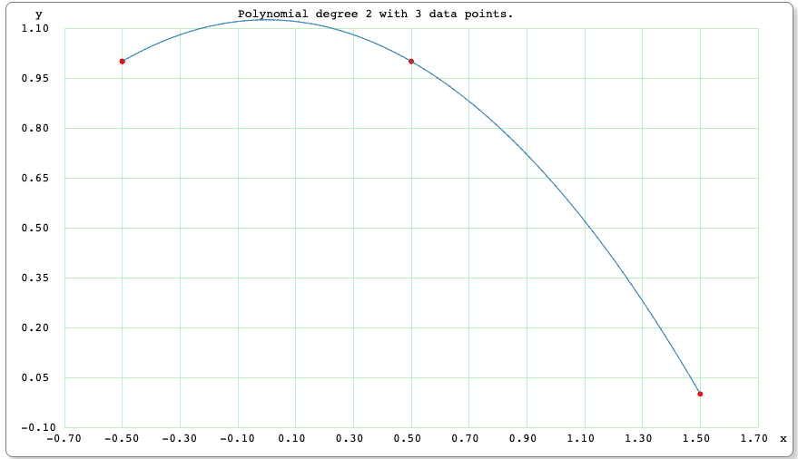
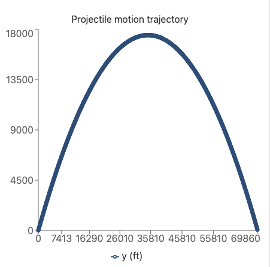
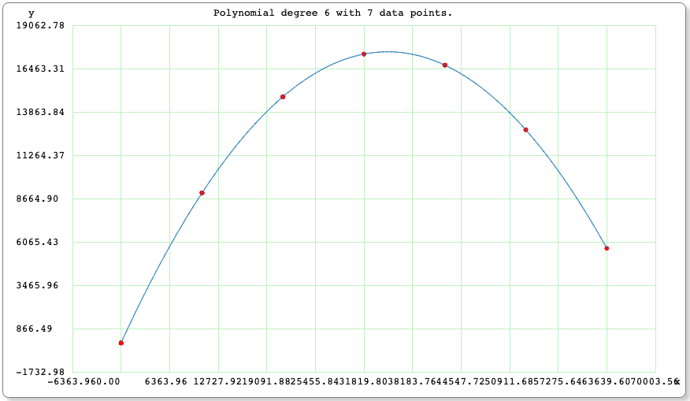
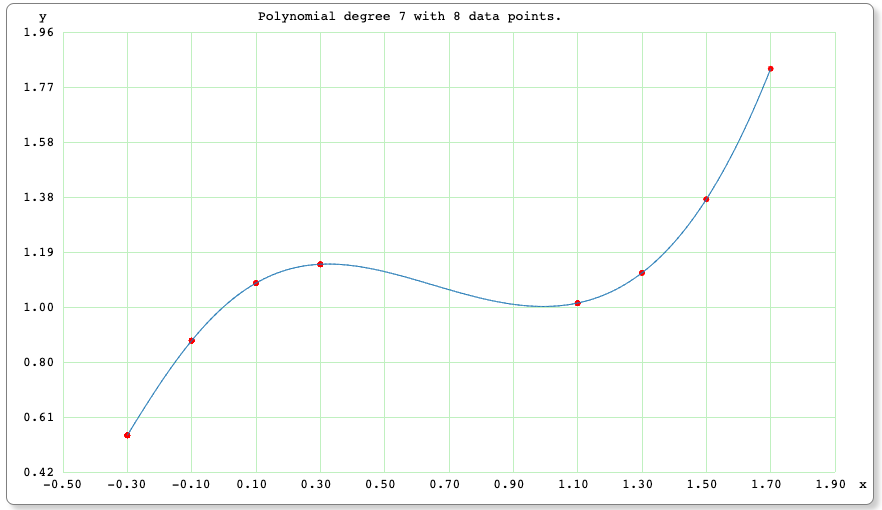
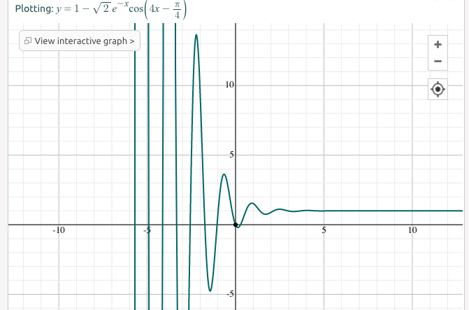
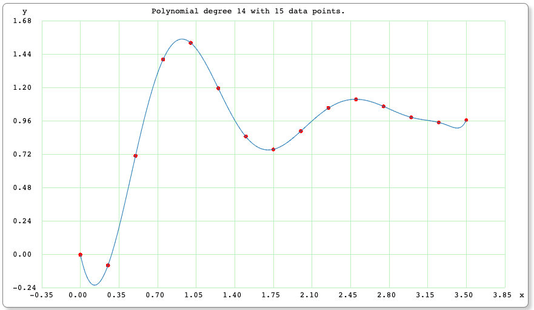
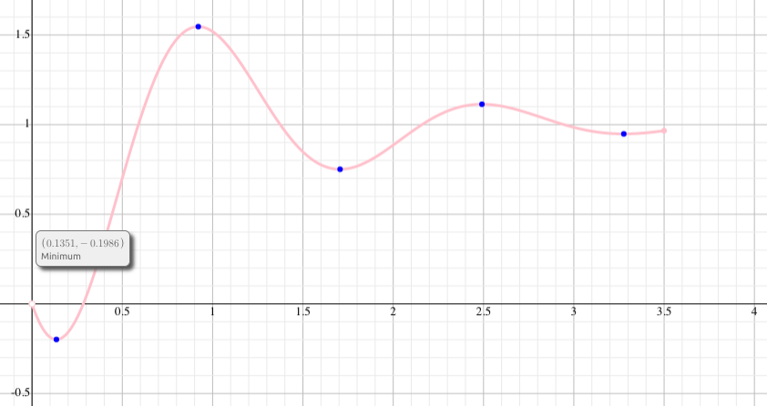
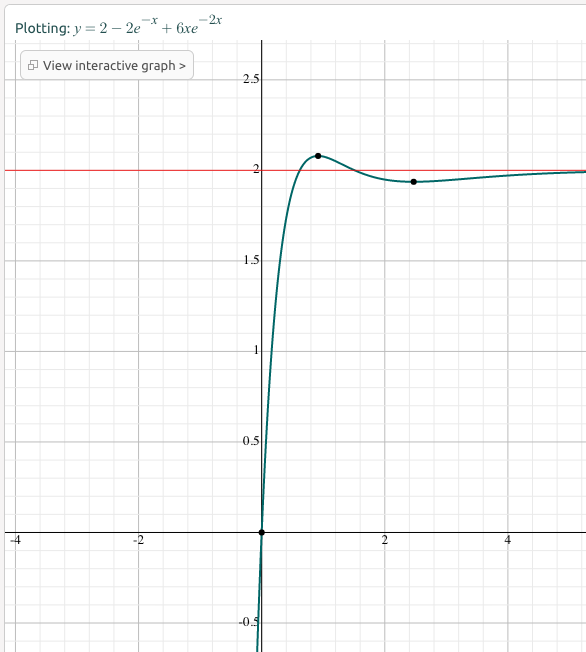
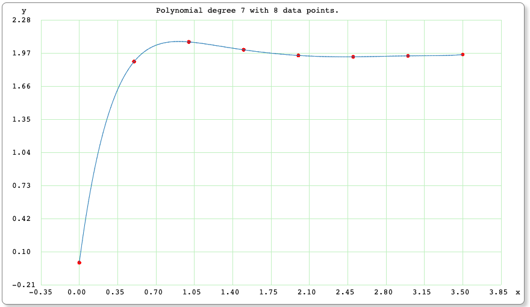

# Test Data Details

This is a description of the data sets that were used in the development and testing of the algorithm. Most of these were presented in the original article. Like in the article, here I will present details of why I chose these data, their challenges and benefits, and the expected "ideal" output results.

---

*4_point_symmetric_simple_maxima_data.csv*

As the name suggests, this data is a simple dataset that consists of 4 points. The peak is not one of the 4 points. The dataset is 'simple' though due to it being symmetric about a single peak at the x-axis and thus represents a simple maxima. So this tests basic functionality. We will not know the exact y value of the maximum though because an equation was not used to provide the points.

So here are the arbitrary points I chose, plotted with an online polynomial solver & plotting program (i.e. https://arachnoid.com/polysolve).

*4_point_symmetric_simple_maxima_data.expected_output.csv*

The single peak at the x-axis was determined by manually inspecting the y value at x=0 in the online plotting program.

<tt>0.0, 1.125</tt>

Running the Cubic Extrema program yields a single extrema at:

<tt>0.000000, 1.150000</tt>

Using the formula to compute the percent error, which in this case will be:

<pre>    % error = (( computed – expected ) / expected) * 100</pre>

shows that we have a x and y errors of 0% and 8%, which isn't too bad since we don't know what the actual expected y value is anyway. We do know that the x will be 0 though since it's symmetric, and we are in the ballpark with our computed y value.

This was a simple dataset to ease into things, but we will have more data sets that have precisely known expected values that are much better tests of accuracy.

---

*3_point_asymmetric_data.csv*

This dataset is the same as the previous dataset, except that the first point is removed. It is intuitive that 2 data points cannot yield an extremum since that would only be a straight line. Thus 3 points represents the minumum number of data points that could yield any min or max when plotted out. So this is a stress test since it's the bare minimum input required to solve for an extrema. This tests the robustness of the algorithm and implemention in determining an extrema based on such a minimal dataset.

*3_point_asymmetric_data.expected_output.csv*

Since the first negative point was removed, we would expect the extrema to shift to the right compared to the 4 point symmetric result. Also, we should expect the expected and the computed values to be less accurate.

The peak for this data was determined via the plotting program by manually moving the cursor back and forth until y was at a max value. That occurs at:

<tt>0.000524, 1.125</tt>

Again, we don't know the true peak location since the data is not based on an input formula, so there is no "correct" value that we can compare to.

The output from running the program is:

<tt>0.077350, 1.096225</tt>

The percent errors will be abnormally high since we are dealing with approximations of input <i>and</i> output, very small numbers in which slight variations will have high impact, and very limited data. So a worse case scenario for the most part, which is not realistic. The y error is still within a few percent though.

---

*7_point_trajectory_data.csv*

This data was hand-calculated based upon the standard equations for trajectories. A 45 degree shot at 1500 ft/sec was used for this data set. Here the plot of that from an online trajectory calculator.

I calculated trajectory x and y values for each 10 seconds of flight. The projectile hits the ground before the last sample is taken and thus the points appear to end mid-air. Here is a plot of those points that comprise the input data to the spline algorithm.

*7_point_trajectory_data.expected_output.csv*

Since this is a simple trajectory problem, we expect only 1 peak to occur. The standard trajectory equations were used to compute that Hmax for this trajectory is approximately 17,468.94 ft, at which the x value is calculated to be 34,937.89 ft. Therefore the calcuated expected xy pair is:

<tt>34937.89, 17468.94</tt>

The Cubic Extrema algorithm should yield a single xy pair and it does indeed at the rounded values of:

<tt>34896.043, 17469.068</tt>

This represents a much more accurate scenario in which to compute a percent error, since we have actual equations that were used to determine the expected "correct" values. And the errors are about 0.1% and 0.0% for the x and y respectively.

---

*8_point_2_root_data.csv*

This data was created by using using the function

<pre>    f(x) = x3 - 2x2 + x + 1</pre>

That allows us to evaluate at precise locations of x to determine the precise expected y values. This function was furthermore used to create a stress-test case since we computed the y at regularly spaced x intervals, but then left out the middle section of data to mimic a lossy data set essentially.

Here is a plot of the data points that I used as the input data, overlaid with a best fit polynomial curve to give you an idea of where the extrema are.

*8_point_2_root_data.expected_output.csv*

And then computing the functions x and y values at the 2 extrema yields our actual expected values:

<tt>0.333, 1.148</tt>

<tt>1.0, 1.0</tt>

The Cubic Extrema algorithm correctly computed 2 extrema, which were at:
<tt>0.325423, 1.147466</tt>
<tt>1.087392, 1.010887</tt>
Those represent errors of approxiately of 2.3% and 0.0% for first extrema, and 8.7% and 1.0% for the second.

---

*15_point_underdamped_second_order.csv*

An equation from control system theory for an underdamped system was used to produce our next data set:

<pre>    y(t) = 1 - sqrt(2) e-t cos(4t - 45o)</pre>

And when the continuous underdamped function is plotted, we can see how wildly the output swings. This hints at how unpredictable this output may be with a generalized algorithm such as the Cubic Spline Extrema. Remember that our algorithm has no knowledge of the equation that yielded the test data points. It only has the points themselves as input.

The discrete input data for our fit "challenge" was created by evaluating the control system equation from t=0 to 3.5 seconds in 0.25 steps. The resulting 15 data points were plotted at https://www.symbolab.com/ and the highest degreee polynomial fit was plotted to show what the approximate extrema look like based upon those data points.

*15_point_underdamped_second_order.expected_output.csv*

If we go back to the plot of the control system equation, we can manually evaluate the minima and maxima of the true output curve. So those become our ideally expected extrema points.

Expected:
<tt>0.1351, -0.1986</tt>

<tt>0.9205, 1.5465</tt>

<tt>1.7059, 0.75083</tt>

<tt>2.4913, 1.1136</tt>

<tt>3.2767, 0.9482</tt>

Computed:
<tt>0.166656, -0.135369</tt>

<tt>0.923947, 1.544151</tt>

<tt>1.707713, 0.751052</tt>

<tt>2.492182, 1.113593</tt>

<tt>3.270703, 0.948298</tt>
  
You can see by visual inspection that we corrected detected 5 extrema, and that all the values are within reason. Some xy pairs are more accurate than others in this wildly varying dataset.

___

This critically damped function data was not presented in the original article, but I used it in the algorithm development and testing. I am providing it here since it has 2 extrema but one is fairly subtle and is thus a good test case. 

<pre>    f(t) = 2 - 2e-t +6te-2t + x + 1</pre>

*8_point_critically_damped_second_order_data.csv*

*8_point_critically_damped_second_order_data.expected_output.csv*

Expected:
<tt>
0.808, 2.179

2.440, 1.935
</tt>
Computed via Cubic Extrema algorithm:
<tt>
0.779256, 2.132046

2.409465, 1.935627
</tt>
Those represent errors of between 0.0 and 3.5% for all the values.

