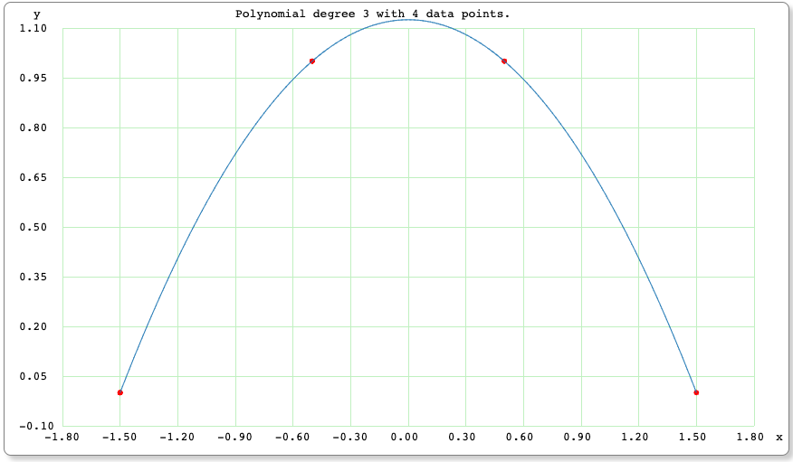

# Test Data Details (Under Construction)

This is a description of the data sets that were used in the original article. So presented here are some details of the input data sets, and the expected "ideal" output results.

---

*4_point_symmetric_simple_maxima_data.csv*

As the name suggests, this data is a simple dataset that consists of 4 points. The peak is not one of the 4 points. The dataset is 'simple' though due to it being symmetric about a single peak at the X axis and thus represents a simple maxima. This dataset though does show that the algorithm can handle data that has negative X values. So here are the arbitrary points I chose, plotted with an online simple polynomial solver & plotting program (i.e. https://arachnoid.com/polysolve).

*4_point_symmetric_simple_maxima_data.expected_output.csv*

The single peak at the X axis was determined by manually inspecting the Y value at X = 0 in the online plotting program. The program indicated the peak to be at this X and Y point, which of course will only be approximate since we are not computing the peak from an exact formula:

0.0, 1.125

Running the Cubic Extrema program yields a single extrema at:

0.000000, 1.150000

Using the formula to compute the percent error, which in this case will be:

<pre>    % error = (( experiment – actual ) / actual) * 100</pre>

shows that we have an x, y errors of only 0%, 2.2% !

---

*3_point_asymmetric_data.csv*

This dataset is the same as the previous 4 point dataset, except that the first point is removed. It is intuitive that 2 data points cannot yield an extremum since that would only be a straight line. Thus 3 points represents the minumum number of data point that could yield any min or max when plotted out. So this is a stress test since it's the bare minimum input required to solve for an extrema. 

*3_point_asymmetric_data.expected_output.csv*

Since the first negative X point was removed, we would expect the extrema to shift to the positive direction compared to the 4 point symmetric result. Also, we should expect the computed direct result to be a bit less accurate given that only 3 input points are provided.
The peak for this data was determined via the plotting program by manually moving the cursor back and forth until Y was at a max value. That occurs at:

0.000524, 1.125

Again, we don't know the true peak location since the data is not based on an input formula, so there is no "correct" value that we can compare to.

The output from running the program is:

0.077350, 1.096225

The x percent error will be abnormally high since we are dealing with approximations of the correct answer, very small numbers, and very limited data. So a worse case scenario for the most part. The y error is within a few percent though.

---

*7_point_trajectory_data.csv*

This data was hand-calculated based upon the standard equations for trajectories. A 45 degree shot at 1500 ft/sec was used for this data set.

*7_point_trajectory_data.expected_output.csv*

Since this is simple trajectory problem, we expect only 1 peak to occur. The standard trajectory equations were used to compute that Hmax (e.g. Y value) for this trajectory is approximately 17,468.94 ft, at which the X value is calculated to be 34,937.89 ft. Therefore the calcuated expected x,y pair is:

34937.89, 17468.94

Therefore the Cubic Extrema should yield a single x,y pair and it does indeed do so at the rounded values of:

34896.043, 17469.068

This represents a much more accurate scenario in which to compute a percent error, since we have actual equations that were used to compute the expected "correct" values.

So the errors are about 0.1%, 0.0% 

---

*8_point_2_root_data.csv*

*8_point_2_root_data.expected_output.csv*

1.0, 1.0

0.333, 1.148

Cubic Extrema computed 2 extrema, as expected, at:

1.087392, 1.010887

0.325423, 1.147466

---

*8_point_critically_damped_second_order_data.csv*

*8_point_critically_damped_second_order_data.expected_output.csv*

Expected:

0.808, 2.179

2.440, 1.935

Computed via Cubic Extrema algorithm:

0.779257, 2.132047

2.408088, 1.935606

___

*15_point_underdamped_second_order.csv*

An equation from control system theory for an underdamped system was used to produce our next data set:

<pre>    y(t) = 1 - sqrt(2) e-t cos(4t - 45o)</pre>

And when the continuous underdamped function is plotted, we can see how wildly the output swings. This hints at how unpredictable this output may be with a generalized algorithm such as the Cubic Spline Extrema. Remember that our algorithm has no knowledge of the equation that yielded the test data points. It only has the points themselves as input data.

The discrete input data for our fit "challenge" was created by evaluating the control system equation from t=0 to 3.5 seconds in 0.25s steps. The resulting 15 data points were plotted at https://www.symbolab.com/ and the highest degreee polynomial fit was plotted to show what the approximate extrema look like based upon those data points.

*15_point_underdamped_second_order.expected_output.csv*

If we go back to the first plot of the control system equation and zoom in on just the region of interest, we can evaluate what the minima and maxima of the true output curve. So those become our ideally expected extrema points.

Expected:

0.1351, -0.1986

0.9205, 1.5465

1.7059, 0.75083

2.4913, 1.1136

3.2767, 0.9482

Computed:

0.166656, -0.135369

0.923947, 1.544151

1.707713, 0.751052

2.492182, 1.113593

3.270703, 0.948298
